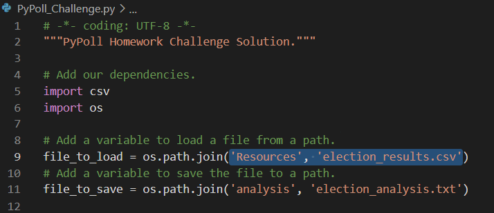
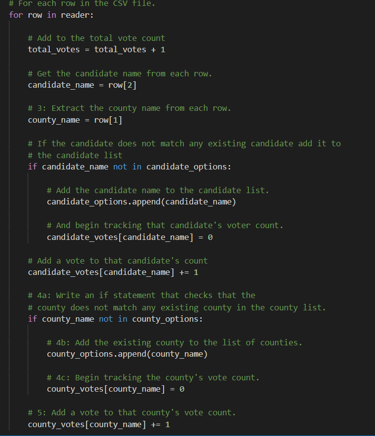
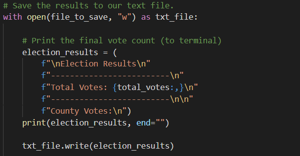

# Election_Analysis

## Project Overview:
  A Colorado Board of Elections employee has given the following tasks, to complete the election audit of a recent local congressional election. 
  
  1. Calculate the total number of voters cast
  2. Get a complete list of candidates who received votes.
  3. Calculate the total number of votes each candidate received.
  4. Calculate the precentage of votes each candidate won.
  5. Determine the winner of the election based on highest votes.

## Resources

  - Data Source: election_results.csv
  - Software: Python 3.7.6

## Summary
  - Below are the observations made, after anlyzing the data provided in a csv file:
  
  ###  - Total Votes: 369,711

  ###  - Candidates who received votes:
        - Charles Casper Stockham
        - Diana DeGette
        - Raymon Anthony Doane

  ###  - Counties where the elections were held:
        - Jefferson
        - Denver
        - Arapahoe

  ### - Winner of the election:
        - Diana DeGette with 73.8% of 272,892 votes

  ### - Final Results after the script has been built:
  
  
  
  ## Reusability
    - The script used for this analysis is attached below. 
    - This has been built to be used in any elections that will be conducted in the future.
   [PyPoll.py](Election_Analysis/PyPoll.py)
    
   ### - Here are some guidelines to reuse this script:
    - This query points to a file that is saved in the resources folder with name: "election_results.csv". 
    - In order to resuse this for another election, newelection data needs to be saved here with the same name.
    - It is also important that the columns of the new file are the same as the old one.
    
  
  
    - After updating the path and running the query, the first for loop starts: 
        1. Counting the total votes casted in the election.
        2. Capturing the names of the candidates for whom votes were casted.
        3. Capturing the county names for which elections were held.

  

    - At this point, total votes casted and votes for each county will be printed to a txt file on the 'Analysis' folder.
  
  
  
    - The next for loop is written to retreive county names, votes casted for each county and percentage of votes from the overall votes.
    - This information is then printed to the same txt file right below the previous analysis.
    - 
