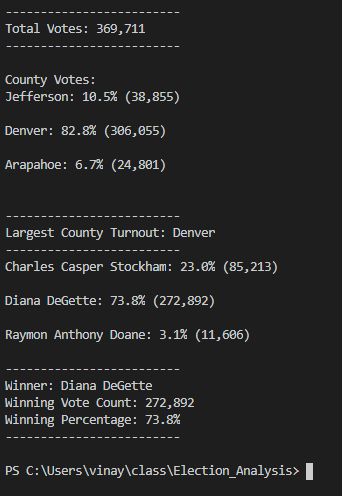

# Election_Analysis

## Project Overview:
  A Colorado Board of Elections employee has given the following tasks, to complete the election audit of a recent local congressional election. 
  
  1. Calculate the total number of voters cast
  2. Get a complete list of candidates who received votes.
  3. Calculate the total number of votes each candidate received.
  4. Calculate the precentage of votes each candidate won.
  5. Determine the winner of the election based on highest votes.

## Resources

  - Data Source: election_results.csv
  - Software: Python 3.7.6

## Summary
  - Below are the observations made, after anlyzing the data provided in a csv file:
  
  ###  - Total Votes: 369,711

  ###  - Candidates who received votes:
        - Charles Casper Stockham
        - Diana DeGette
        - Raymon Anthony Doane

  ###  - Counties where the elections were held:
        - Jefferson
        - Denver
        - Arapahoe

  ### - Winner of the election:
        - Diana DeGette with 73.8% of 272,892 votes

  ### - Final Results after the script has been built:
  
      
